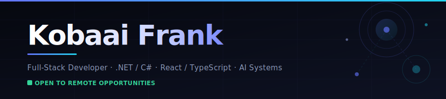

<div align="center">

[](https://www.linkedin.com/in/kobaai-frank-683592384)
[](mailto:frankobaai@gmail.com)
[](https://wreckingball.ai)
[](https://resume-rho-nine-52.vercel.app)
[](https://github.com/frankobaai)

</div>

<br/>

### About Me

```typescript
interface Developer {
  name: string;
  role: string;
  location: string;
  available: boolean;
  stack: {
    backend: string[];
    frontend: string[];
    database: string[];
    ai: string[];
    other: string[];
  };
  contact: string;
}

const frank: Developer = {
  name: "Kobaai Frank",
  role: "Full-Stack Developer",
  location: "Remote",
  available: true,
  stack: {
    backend: [".NET 8/9", "C#", "ASP.NET Core", "EF Core", "SignalR", "Node.js", "Fastify"],
    frontend: ["React 18/19", "TypeScript", "React Native", "Next.js 14", "Tailwind CSS", "Vite"],
    database: ["PostgreSQL", "SQLite", "Redis", "Supabase", "MariaDB"],
    ai: ["OpenAI", "Claude", "Ollama", "Gemini", "Semantic Kernel", "RAG"],
    other: ["WordPress", "PHP", "Docker", "MQL5/MT5", "GraphQL", "Stripe"],
  },
  contact: "frankobaai@gmail.com",
};
```

<br/>

### Currently Building


<br/>

### Tech Stack

<div align="center">

</div>

<br/>

### Live Deployments

| Product | Description | Stack | Link |
|---------|-------------|-------|------|
| **Bugatti Insights** | Historical chassis registry with editorial and structured data workflows | .NET 9 · React 19 · WordPress · SignalR | [bugattiinsights.nl](https://bugattiinsights.nl) |
| **WreckingBall AI** | AI automation SaaS platform | React 18 · TypeScript · Vite | [wreckingball.ai](https://wreckingball.ai) |
| **ProsperGenics** | AI-first business platform and systems work | React · TypeScript · AI Systems | [prospergenics.com](https://prospergenics.com) |
| **ArtRevisionist** | Custom WordPress art platform with bespoke theme and plugin work | WordPress · PHP · React · REST API | [artrevisionist.com](https://artrevisionist.com) |
| **Gmail AI Reader** | Local AI email management workflow | React · TypeScript · Gmail API | [Live](https://gmail-ai-reader.netlify.app) |

<br/>

### What I Build

```text
Bugatti Insights    -> .NET 9 + React 19 + WordPress   | registry platform | editorial workflow
Autonomous Dev      -> agent tooling + automation       | memory | orchestration | execution
ynode               -> React + Node.js                  | visual workflow automation
ArtRevisionist      -> WordPress + PHP + React          | custom content platform
Nyao Scalper        -> MQL5 / MetaTrader 5              | trading logic | risk profiles
WhatsApp Automation -> Node.js + n8n                    | messaging | orders | workflow automation
```

<br/>

### Featured

<div align="center">
  <a href="https://github.com/frankobaai/artrevisionist-wp-plugin">
    
  </a>
  &nbsp;
  <a href="https://github.com/frankobaai/frankobaai">
    
  </a>
</div>

<br/>

### GitHub Stats

<div align="center">

&nbsp;&nbsp;

</div>

<div align="center">

</div>

---

<div align="center">
  <b>Open to remote full-stack opportunities</b><br/><br/>
  <a href="mailto:frankobaai@gmail.com">frankobaai@gmail.com</a> &nbsp;·&nbsp;
  <a href="https://www.linkedin.com/in/kobaai-frank-683592384">LinkedIn</a> &nbsp;·&nbsp;
  <a href="https://wreckingball.ai">Portfolio</a> &nbsp;·&nbsp;
  <a href="https://resume-rho-nine-52.vercel.app">Resume</a>
</div>
